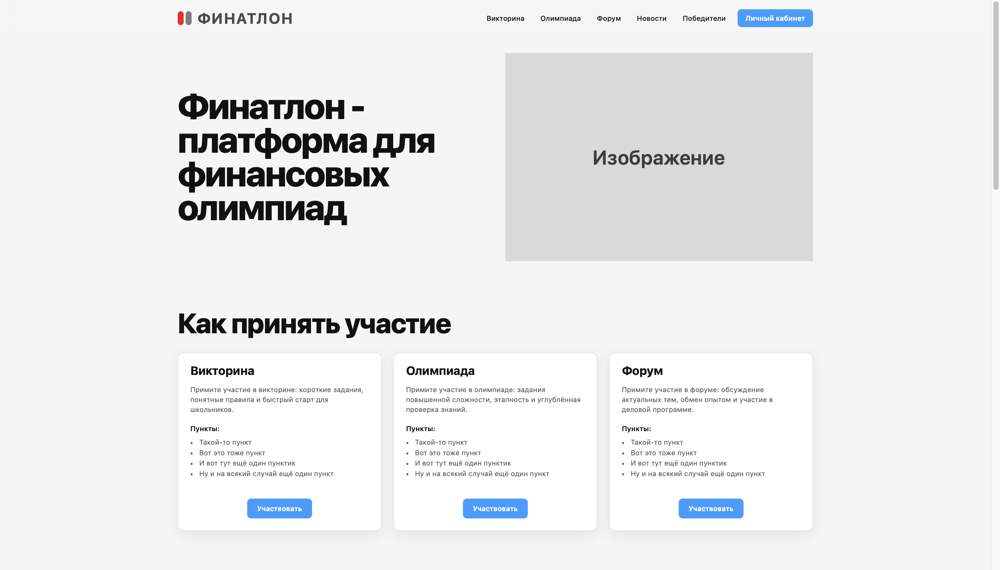

# Finathlon

# Finathlon project for the "Project-Based Activities" course





## Stack

- React  
- TypeScript  
- Vite  
- React Router  


## Quick Start

Follow these steps to set up the project locally on your machine.

### Prerequisites

Make sure you have the following installed on your machine:

- [Git](https://git-scm.com/downloads)  
- [Node.js](https://nodejs.org/en)  
- [npm](https://www.npmjs.com/) (Node Package Manager)  

### Cloning the repository

```sh
git clone https://github.com/avariceJS/finathlon.git
cd finathlon
```

### Installation

Install the project dependencies using npm:

```sh
npm install
```

### Running the project

```sh
npm run dev
```

Open [http://localhost:5173](http://localhost:5173) in your browser to view the project.
