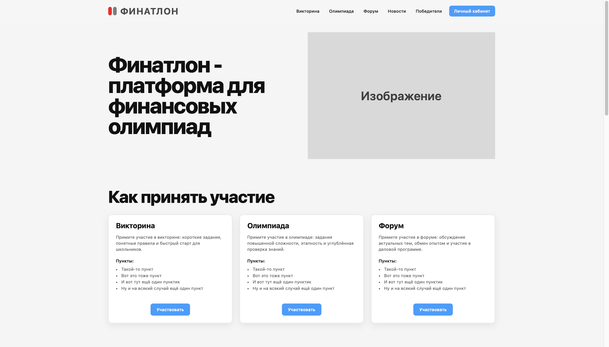

# Финатлон

Платформа для финансовых олимпиад, викторин и форума «Профессионалы будущего».
Это fullstack-приложение на React + Vite + Supabase:

- публичная часть (главная, новости, мероприятия, партнёры, документы);
- личный кабинет пользователя с редактированием профиля и историей участия;
- админ-панель с CRUD по всему пользовательскому контенту.



## Стек

- React 19 + TypeScript + Vite
- React Router 7
- Supabase (Postgres + Auth + RLS)
- CSS Modules

## Запуск локально

```sh
npm install
cp .env.example .env.local   # затем подставьте свои URL/anon key
npm run dev
```

Откройте `http://localhost:5173`.

## Полезные пути

- `/` — главная (контент из Supabase)
- `/news`, `/news/:slug` — новости
- `/events`, `/events/:slug` — мероприятия и таймлайн
- `/partners` — партнёры, организаторы, попечительский совет
- `/documents` — документы по категориям
- `/account/personal` — личный кабинет (требует входа)
- `/admin` — админ-панель (требует роль `admin`)

## Структура

```
src/
├── app/                # Корень приложения, роутер
├── pages/              # Страницы (HomePage, NewsListPage, AccountPage, AdminX...)
├── widgets/            # Сложные UI-блоки страниц
├── features/           # Фичи (AuthModal)
├── entities/           # Доменные типы (NewsArticle, Profile, ...)
└── shared/             # api, supabase client, ui-примитивы, lib, config
```

## Supabase

См. [SUPABASE.md](./SUPABASE.md) для информации по схеме, RLS и применению миграций.
